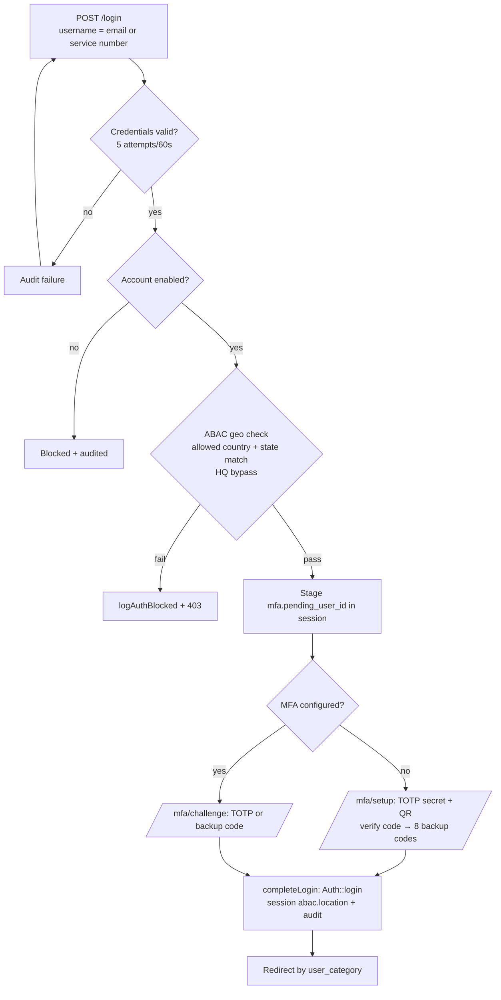
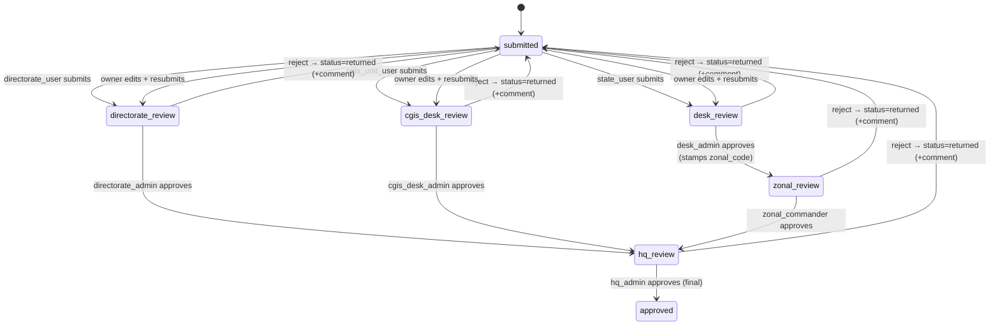
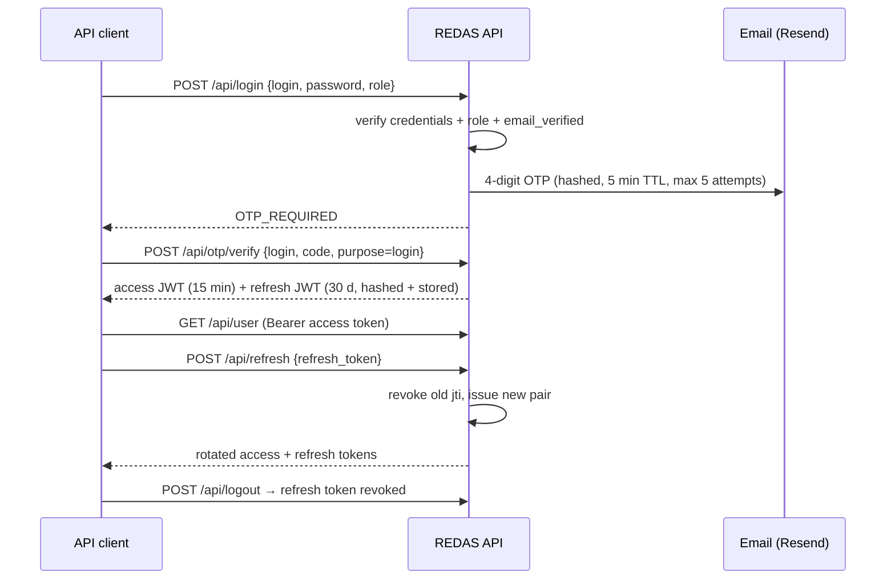

# NIS REDAS — Application Flow

**Scope:** End-to-end user journeys, route map, and the returns approval state machine.
**Source of truth:** `routes/web.php`, `routes/api.php`, `app/Services/SubmissionWorkflow.php`, `app/Http/Controllers/`.

---

## 1. Route map

### 1.1 Public / guest

| Route | Handler | Notes |
|---|---|---|
| `GET /`, `/home` | `welcome` view | Falls back to `/login` |
| `GET /terms-and-conditions`, `/privacy-policy` | `legal.terms` / `legal.privacy` | Static legal pages |
| `GET /directory` | `Web\DirectoryController@index` | Public NIS directory: 8 categories, tabs, search, pagination |
| `GET /login` | `login` view | Guest only |
| `POST /login` | `AuthController@login` | Throttled 10/min + 5 attempts/60 s in-controller |
| `GET /register` | redirect → `/login` | Self-service disabled; HQ admins provision accounts |
| `GET /password/forgot`, `POST /password/forgot` | `AuthTokenController` | Enumeration-safe reset request |
| `GET|POST /password/reset/{token}` | `AuthTokenController` | Single-use token, min 8 chars |
| `GET /verify-email/{token}` | `AuthTokenController@verifyEmail` | Sets `email_verified_at` |

### 1.2 MFA staging (`mfa.pending` middleware)

| Route | Handler |
|---|---|
| `GET|POST /mfa/setup` | `MfaController@setup` / `verifySetup` (QR + secret → 8 backup codes) |
| `GET|POST /mfa/challenge` | `MfaController@challenge` / `verifyChallenge` (TOTP or backup code) |
| `POST /mfa/complete`, `/mfa/cancel` | finish / abort pending login |

### 1.3 State user / officer (`auth` + `abac.geo`)

| Route | Handler / view |
|---|---|
| `GET /user/dashboard` | `user.dashboard` |
| `GET /user/returns/create`, `POST /user/returns` | return form; `SubmissionWorkflow::create()` |
| `GET /user/submissions` | `Web\DashboardController@stateSubmissions` — own submission list (dynamic) |
| `GET /user/returns/{application}` | `Web\DashboardController@showSubmission` — owner-only detail |
| `GET /user/returns/{application}/edit`, `PUT /user/returns/{application}` | owner edit/resubmit (while not approved) |
| `DELETE /user/returns/{application}` | owner delete (while not approved); removes uploaded files from storage |
| `GET /user/returns/{application}/documents/{collection}/{index}` | owner document streaming |
| `GET /user/submissions/{application}/pdf` | `Web\DashboardController@downloadSubmissionPdf` (owner or in-scope approver) |
| `GET /user/notifications` (+ `/api`, `/count`, mark-read) | `ApiNotificationController` (session auth) |
| `GET /user/archive`, `GET|POST /user/archive/upload` | approved returns in scope; upload is a **validated stub** |
| `GET /user/reports`, `POST /user/reports/generate` | **stub** — redirects with success message |
| `GET|PATCH /user/profile` | `ProfileController` — password change |

### 1.4 Directorate users (`access:category=directorate_user|directorate_admin` — state users also allowed on form routes)

| Route | Handler |
|---|---|
| `GET /user/directorates/dashboard` | `Web\DashboardController@directorateDashboard` |
| `GET|POST /user/directorates/{slug}` | 10 directorate return forms (`hrm`, `prs`, `finance`, `investigation`, `passport`, `visa`, `migration`, `border`, `ict`, `works-logistics`); store validates period/officer/consent/uploads ≤ 20 MB |
| `GET /user/directorates/submissions/{application}` (+ `/print`, `/edit`, `PUT update`, `DELETE`, `/documents/{collection}/{index}`) | owner-only view/print/edit/resubmit/delete |
| `GET /user/directorate/{id}` | legacy numeric redirect (1→hrm … 10→works-logistics) |

### 1.5 CGIS unit users (`access:category=cgis_unit_user,location=unit|headquarters,role=user|officer|unit_officer`)

| Route | Handler |
|---|---|
| `GET /user/cgis-units` → redirect, `GET /user/cgis-units/dashboard` | `Web\DashboardController@cgisUnitDashboard` |
| `GET|POST /user/cgis-units/{slug}` | 7 CGIS unit return forms (`actu`, `epms`, `hostmanship`, `pro-media`, `protocol`, `provost`, `servicom`); store validates period/officer/consent/uploads ≤ 20 MB |
| `GET /user/cgis-units/submissions/{application}` (+ `/print`, `/edit`, `PUT update`, `DELETE`, `/documents/{collection}/{index}`) | owner-only view/print/edit/resubmit/delete |

### 1.6 Approvers (all render the shared `desk-admin.dashboard` queue)

| Group | Guard | Routes |
|---|---|---|
| Desk admin / directorate admin / CGIS desk admin / HQ admin | `access:category=desk_admin\|directorate_admin\|cgis_desk_admin\|hq_admin,location=state\|directorate\|unit\|headquarters,…` | `GET /desk-admin/dashboard`, `/desk-admin/reports` (CSV/PDF export), `PATCH …/submissions/{application}/approve\|reject`, `GET …/submissions/{application}` (+ `/download`, `/documents/…`) |
| Zonal commander | `access:category=zonal_commander,location=zonal,…` | `GET /zonal/dashboard`, `PATCH /zonal/submissions/{application}/approve\|reject` |
| HQ admin | `access:category=hq_admin,location=headquarters,minLevel=5` | `GET /admin/submissions` + approve/reject (stage `hq_review` → `approved`, **final**) |
| Supervisor | `desk_admin\|zonal_commander` | `GET /dashboard/state`, `/dashboard/zonal`, `/supervisor/dashboard` (redirect by category) |

### 1.7 HQ area (`/admin`, `/superadmin`)

Read-only routes — shared by `hq_admin` and the view-only `admin` (`access:category=hq_admin|admin,location=headquarters,minLevel=5`):

| Route | Handler |
|---|---|
| `GET /admin/dashboard` | `HqAdminController@index` — stats, per-directorate/CGIS-unit aggregates |
| `GET /admin/hq/returns` (+`/{application}`, `/documents/…`) | filterable return register; single return with workflow timeline |
| `GET /admin/hq/archive` | approved returns |
| `GET /admin/hq/analytics` | charts + avg stage turnaround from `workflow_path` |
| `GET|POST /admin/hq/reports[/generate]` | quarterly/biannual/annual consolidated Excel (audit-logged) |
| `GET /admin/consolidation` | `Admin\ConsolidationController@index` — consolidated cross-formation view |

`hq_admin`-only routes (`access:category=hq_admin,…`) — final review actions and platform administration:

| Route | Handler |
|---|---|
| `GET /admin/submissions` + `PATCH …/approve\|reject` | final review queue (stage `hq_review` → `approved`) |
| `GET|PUT /admin/settings` | ABAC + geolocation settings |
| `GET /admin/audit-log` | filterable audit trail |
| `GET|POST|PATCH /admin/users…` | user CRUD, enable/disable, sends verification magic link |

Super admin — executive, strictly view-only (`access:category=super_admin,location=headquarters,minLevel=6`):

| Route | Handler |
|---|---|
| `GET /superadmin/dashboard` | `Admin\SuperAdminController@dashboard` — Chart.js KPIs/charts |
| `GET /superadmin/returns`, `/superadmin/returns/{application}` (+ `/documents/…`) | returns register + detail |

### 1.8 JSON API (`throttle:api`)

| Route | Handler | Auth |
|---|---|---|
| `POST /api/login` | `ApiAuthController@login` | public — returns `OTP_REQUIRED` |
| `POST /api/otp/request`, `/api/otp/verify` | `ApiOtpController` | public — verify issues JWT pair |
| `POST /api/refresh` | `ApiAuthController@refresh` | refresh-token rotation |
| `GET /api/user`, `/api/notifications…`, `POST /api/logout` | — | `JwtAccessTokenMiddleware` |

---

## 2. Login + MFA flow (web)

Landing pages by category: state_user → `/user/dashboard`; desk_admin / directorate_admin / cgis_desk_admin → `/desk-admin/dashboard`; directorate_user → `/user/directorates/dashboard`; cgis_unit_user → `/user/cgis-units/dashboard`; zonal_commander → `/zonal/dashboard`; hq_admin / admin → `/admin/dashboard`; super_admin → `/superadmin/dashboard`.

## 3. Returns approval state machine

Key rules (`SubmissionWorkflow`):

- **Scope visibility:** approvers only see submissions matching their `scope_code`; zonal commanders match `zonal_code` (fallback `scope_code`). Desk-admin approval stamps `zonal_code` from `assigned_zonal_command_code` for zonal routing. CGIS submissions carry `category=cgis` and `scope_code` = unit slug (`actu`, `epms`, `hostmanship`, `pro-media`, `protocol`, `provost`, `servicom`); the dedicated `cgis_desk_admin` for that unit reviews them at the `cgis_desk_review` stage, after which they join the common `hq_review → approved` chain. The legacy `admin_review` stage (`STAGE_ADMIN_REVIEW`) is retained only for historical data — nothing routes to it anymore.
- **Statuses:** `pending` (in flight) → `approved` (final, set by HQ-admin approval) or `returned` (rejected back to originator). Legacy `submitted`/`queried`/`rejected` tolerated in counts.
- **Audit trail:** every action appends `{stage, by, at, action}` to the JSON `workflow_path`; resubmission adds a `resubmitted` entry and re-enters the first stage. Every action is also recorded as a row in `application_comments` (actions: submitted/resubmitted/approved/rejected/note), rendered as a review-history thread on the desk-admin preview, owner submission, and HQ return-detail pages.
- **Reject requires a comment**, saved on the application (`applications.comments` holds the latest rejection reason) and in the comment history for the originator; approvals accept an optional note (input `note`).
- **Submitter CRUD:** owners can edit/resubmit or delete their own return while `status != 'approved'` (`SubmissionWorkflow::deletableBy`); approved returns are locked, and delete removes uploaded files from storage.

## 4. API authentication flow

## 5. HQ admin journey

1. Login (geo-exempt HQ bypass if enabled) → `/admin/dashboard` (totals, awaiting-HQ, aggregates).
2. Review queue at `/admin/submissions` (stage `hq_review`) → approve finalizes the return (`approved`), reject returns it to the originator.
3. Return register at `/admin/hq/returns` — filter by formation/category/status/stage/period/search; drill into a return to see the full workflow timeline and comment history.
4. Analytics at `/admin/hq/analytics`; consolidated Excel reports at `/admin/hq/reports` (quarterly/biannual/annual, generation audited); consolidation view at `/admin/consolidation`.
5. User management at `/admin/users` — create/edit access profiles, enable/disable, trigger verification email.
6. Tune ABAC/geolocation at `/admin/settings`; inspect security events at `/admin/audit-log`.
7. The view-only `admin` category shares the read-only pages (dashboard, returns, archive, analytics, reports, consolidation) but has no approve/reject, settings, audit-log, or user-management access. The `super_admin` executive monitors KPIs and charts at `/superadmin/dashboard` and browses the returns register at `/superadmin/returns`; approved returns appear in `/admin/hq/archive`.

## 6. Password reset & email verification

1. `GET /password/forgot` → submit email → enumeration-safe response; email contains `password_reset_magic_link` (hashed, single-use, 1 h TTL).
2. `GET /password/reset/{token}` probes the token without consuming it; `POST` consumes it and sets the new password (min 8, confirmed).
3. New accounts (created by HQ admin) receive `verify_email_magic_link`; `GET /verify-email/{token}` marks the email verified.

## 7. Notification flow

`user_notifications` are read via both session (`/user/notifications/*`) and JWT (`/api/notifications*`) endpoints: list, unread count, mark read, mark all read. Producers live in `SubmissionWorkflow`: submission and resubmission notify in-scope reviewers of the pending stage (`notifyPendingReviewers()`), approval notifies the submitter and next-stage reviewers, and rejection notifies the submitter with the reason (`notifySubmitter()`).

## 8. Known flow gaps

- `/user/reports/generate` and `/user/archive/upload` validate but don't persist/generate (stubs).
- Root `DashboardController` / `AdminDashController` are dead code; `register` view is vestigial.
